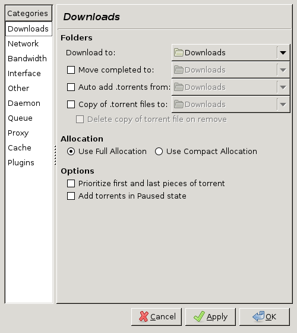

# Summary

These instructions will help you setup a ssh server, with password
authentication, and deluge, the torrenting software. The idea is to use SFTP
from one computer to another, and upload torrents to a specific directory.
Deluge then automatically detects torrents being added to the folder, and
queues them to the download queue. This allows for a more pleasant experience
of task automation (because machines are supposed to do trivial, repetitive
and boring stuff - they're called computers for a reason).

# Environment setup

Setting up the torrents for the computer: 

On the laptop, you're going to need to install some server. There are two
options. One is to install ssh (if it is not there already), and the other is
to install something like VNC, as it was before. I think for our case, using
ssh would be much more easier for a reason that will be outlined to you in the
following paragraphs. When you install ssh, you can use SFTP in order to
connect to the computer. SFTP is supported by Filezilla, and other tools as
well.

You will need to configure your system to do two things. You need to make it:

1. Execute the sshd daemon on boot (a process that runs in the background, and
acts as a server)

2. Make sure the configurations of sshd are correct.

For Xubuntu / Lubuntu and the like, you should be able to read more (if needed)
here [USSH]. I've summarized the steps as concise as I can for you on this
document.

Let's start off by installing the ssh server. 

````bash
sudo apt-get install openssh-server
````

When that installs, it comes with some default configurations. It would be a
good idea to store the default configurations in case something horrible
happens.  So you can run the following commands in order to save a copy of the
configurations.

````bash
sudo cp /etc/ssh/sshd_config /etc/ssh/sshd_config.factory-defaults
sudo chmod a-w /etc/ssh/sshd_config.factory-defaults
````

Now we need to open the configurations with a text editor in order to taylor
the application to our needs.

````bash
sudo gedit /etc/ssh/sshd_config
````

Now look for the following lines and set them to the given values as
demonstrated.

````
Port 30000

...

PasswordAuthentication no
````

Notice the port value. The port can be any value you set. You need to remember
that port however, since when you will be connecting, you will need to specify
that very port. You could also leave it to the default value `22` which would
save you from entering the custom port.

When we're done, we need to restart `sshd` in order to reload the new
configurations. You can assume that each time you change something in the
`sshd_config` file, you will need to restart the `sshd` daemon.

````bash
sudo restart ssh
````

## Getting a Torrenting application

We've checked out Transmission before. I've recently switched to something
newer and better. It's called Deluge. Get Deluge, it is worth it.

````bash
sudo apt-get install deluge
````

So now, you can start deluge on the laptop. You will need to configure deluge
for a special case. The special case is to look at a specified directory for
file additions. When there is a file addition (hopefully a torrent) in this
directory, deluge will detect it, and add it to the queued downloads. So in
this way you can just focus on uploading the torrent to that directory and
deluge will take care of the downloads for you. You just need to do the
following: run deluge, and go to the preferences by pressing the Edit menu
button. You can see this in figure \ref{fig:pref}.



Check the 'auto add torrents' checkbox. And also specify a location if you 
want your torrents to be downloaded somewhere in particular.

This should be pretty much what you need.

# References:

[USSH][Open SSH Configuration (Ubuntu)](https://help.ubuntu.com/community/SSH/OpenSSH/Configuring)
