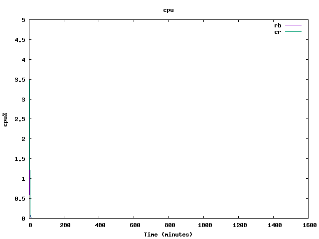
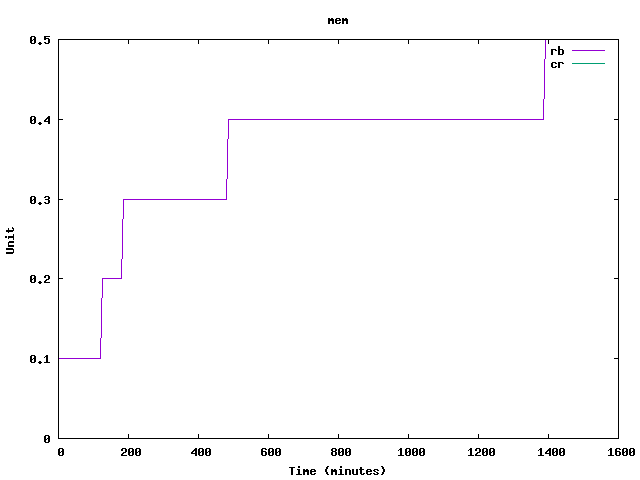
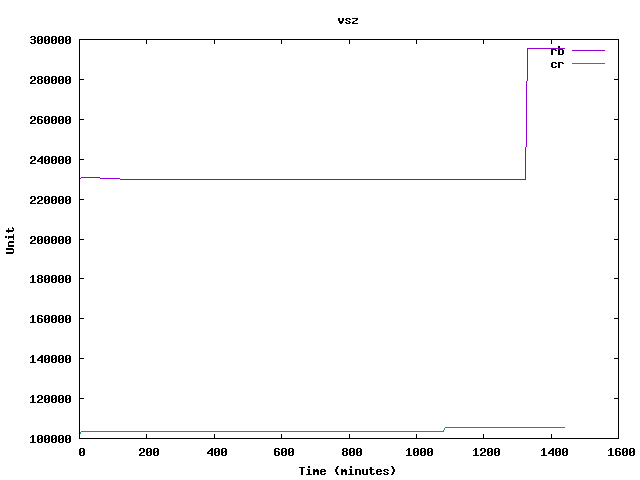
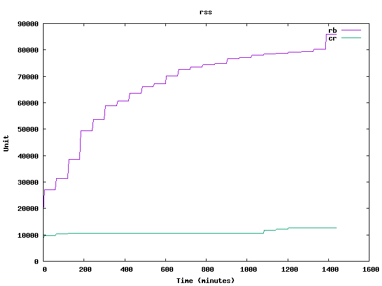

# An Interesting Debt Twist (Wed 06 Dec 2017)

So we're living in a time where a some interesting languages are
showing up. Currently in mind, I have Rust, though this post is not
about Rust directly, and my opinion about Rust might not be totally
well received by anyone reading this.

With the current state of the language, I look at Rust as something
that fills a gap between scripting languages and performant
implementations. (Ouch. Please don't hate me :)).

And (anecdotaly) looking at the state of the Ruby ecosystem it seems
common to want to replace some software with Rust alternatives. For
example even skylight, a tool which is used to profile Rails
applications is written in Rust.

However, I finally gave a shot at a language called Crystal. It's a
language that extremely resembles Ruby, but is compiled and garbage
collected. Let me stress the resemblance: you can almost run a Ruby
script without changing anything in most cases. This raises an
interesting question: how effortlessly can I migrate a Ruby project
into Crystal, and what are the benefits if any?

By benefits, I'm talking about memory footprint and perhaps even cpu
usage.

## Sad news

Seems like someone had the same idea with a slightly different
approach here:

This guy cares more about the process, and generated deliverables:
- http://squarism.com/2017/02/25/porting-ruby-to-crystal/

This guy benchmarks performance of the two languages
- https://spin.atomicobject.com/2017/03/24/ruby-to-crystal-test/

I kind of did both, but my benchmarks weren't considering very active
CPU usage. I did benchmark some memory footprints however, so yay.

Found these after I was finished with my little project.

## Ruby and Crystal versions used

- Ruby: 2.4.1p111
- Crystal: 0.24.1 (llvm 4.0.1)

## Testing Topics

String manipulation, socket/http use, threading, crypto somewhat.

Source diff line counts to see how many changes were required from the
original Ruby project (stlkr) to swap to the Crystal project
(stlkr-cr).

## Methodology

I had written a small project called `stalker`, that `GET`s urls on
certain websites, hashes the contents, and notifies you when things
had changed. This was especially handy in university when you had to
check certain professor's webpages which would secretly update without
other means of notifications. It's an old piece which was bloated with
some irrelevant libraries for this small case study.

The first step is to remove the above, and keep something clean, free
of libraries such as libnotify and GTK.

When things are ready, we fork the project, and begin the conversion
to Crystal. This is to keep history in git, and extract metrics in the
future.

The unix utility `ps` will be used to monitor CPU usage as well as
memory usage. It's not the greatest way to do things, but this is what
currently available.

## Measurements of Interest

- Diff line count to migrate to Crystal
- Memory
- CPU usage

## Pains when converting to Crystal

- Had to learn how a 'Shard' is structured (it's the analogus to a
  gem). This wasn't as bad. Apparently you need one entry point
  usually, and the requires will lead to the compiler understanding
  all the programming units that compose your application.
- Keep being thrown off by strings (" vs '). In existing repo, had to
  convert many of the string literals to use " instead of '.
- Compilation somewhat slow, but binaries feel much better than
  waiting for scripts to be interpreted
- Encountered 'ENV' and I knew that was a specific ruby thing that
  looks into current environment vars. Was not sure if it was going to
  work out of the box. It actually did! This does exactly what you
  expect:

```crystal
module Stlkr
  NAME = "stlkr"
  HOME = ENV["HOME"]
```

- `require 'fileutils'` ==> `require "file_utils"`

- Exceptions are slightly different in Crystal

```crystal
  def initialize(url, hash=nil)
    @url = url
    @hashcode = hash
    fetch! if hash.nil?
  rescue e : SocketError
    puts "Could not reach host"
    puts e
  end
```

whereas in Ruby:

```ruby
  def initialize(url, hash=nil)
    @url = url
    @hashcode = hash
    fetch! if hash.nil?
  rescue SocketError => e
    puts "Could not reach host"
    puts e
  end
```

- Crystal compiler is kind of cool:

```nocode
Syntax error in src/stlkr/website.cr:62: for empty hashes use '{} of KeyType => ValueType'

    YAML.load(cont) || {}
```

- Properties are a little strange:

```crystal
Syntax error in src/stlkr/website.cr:88: expecting token 'CONST', not '@url'

    uri = URI(@url)
              ^
```

- Accessors are renamed to properties (get/set), and there's also
  `setters` and `getters`

```nocode
in src/stlkr/stalker_service.cr:36: undefined method 'attr_accessor'

  attr_accessor :done
  ^~~~~~~~~~~~~
```

Before:

```ruby
  attr_accessor :url
  attr_accessor :hashcode
  attr_accessor :username
  attr_accessor :password
```

After (notice de-symnolization):

```crystal
  property url : String
  property hashcode : String | Nil
  property username : String | Nil
  property password : String | Nil
```

- `require 'open-uri'` becomes `require "uri"`

- `require 'net/http'` becomes `require "http/client"`


Here's the main query parts adapted into crystal code

```crystal
  private def auth_fetch!
    uri = URI.parse(@url)
    http = HTTP::Client.new(uri.host, uri.port)
    request = Net::HTTP::Get.new(uri.request_uri)
    request.basic_auth(@username, @password)
    response = http.request(request)
    @hashcode = Website.hashify(response.body)
  end

  private def plain_fetch!
    uri = URI.parse(@url)
    contents = HTTP::Client.get(uri).body
    @hashcode = Website.hashify(contents)
  end
end
```

- control structure for `until` is different:

from ruby:

```ruby
until done do
  # ...
end
```

to crystal:

```crystal
until done
  # ...
end
```

- visibility modifiers (`private`, `public`, `protected` etc), need to
  be be explicitly stated before each definition.

```ruby
private
  def a; end
  def b; end
  def c; end
```

and crystal:

```crystal
private def a; end
private def b; end
private def c; end
```

- Crystal compiler can guide some of the changes you need to do:

```nocode
Error in src/stlkr-bin.cr:42: instantiating 'Stlkr::Website:Class#new(String)'

  w = Website.new(options[:add_link])
              ^~~

in src/stlkr/website.cr:9: instantiating 'initialize(String, Nil)'

  def initialize(url, hash=nil)
  ^

in src/stlkr/website.cr:10: Can't infer the type of instance variable '@url' of Stlkr::Website

The type of a instance variable, if not declared explicitly with
`@url : Type`, is inferred from assignments to it across
the whole program.

The assignments must look like this:

  1. `@url = 1` (or other literals), inferred to the literal's type
  2. `@url = Type.new`, type is inferred to be Type
  3. `@url = Type.method`, where `method` has a return type
     annotation, type is inferred from it
  4. `@url = arg`, with 'arg' being a method argument with a
     type restriction 'Type', type is inferred to be Type
  5. `@url = arg`, with 'arg' being a method argument with a
     default value, type is inferred using rules 1, 2 and 3 from it
  6. `@url = uninitialized Type`, type is inferred to be Type
  7. `@url = LibSome.func`, and `LibSome` is a `lib`, type
     is inferred from that fun.
  8. `LibSome.func(out @url)`, and `LibSome` is a `lib`, type
     is inferred from that fun argument.

Other assignments have no effect on its type.

Can't infer the type of instance variable '@url' of Stlkr::Website

    @url = url
    ^~~~
```

- If you have a type in the form of `String | Nil` you might need to
  use `not_nil!` to get the compiler off your back.

Example:

```crystal
    http = HTTP::Client.new(uri.host.not_nil!)
```

This is an assertion, very similar to Rust's panic, which will make
the program halt if the value is nil.

- Dealing with YAML has been infuriating.

- YAML objects are read only. This means that to update values you
  need to create a new object representing your changes, and then
  serialize it to yaml.

- Arrays and Hashes need to be declared with their types (sometimes
  the compiler can infer the type but meh).

- No `retry` control structure, and the owner doesn't seem very keen on adding it:
  https://github.com/crystal-lang/crystal/issues/1736 ; what this
  means is that migrating certain projects in a similar fashion might
  require some extra tweaking in the control logic.

- And finally:

```nocode
psyomn@minixaos ~/programming/crystal/stlkr-cr $ shards build
Dependencies are satisfied
Building: stlkr-cr
psyomn@minixaos ~/programming/crystal/stlkr-cr $ ./bin/stlkr-cr -l
http://www.perdu.com
http://www.jamilin.com
http://www.gatesnfences.com
http://www.pennyjuice.com
http://www.bolenreport.com
http://www.007museum.com
http://www.arngren.net
http://www.patimex.com
http://www.irishwrecksonline.net
http://electrifyingtimes.com/
psyomn@minixaos ~/programming/crystal/stlkr-cr $ ./bin/stlkr-cr -s
[2017-12-29 17:31:39 -05:00] Not Changed: #<Stlkr::Website:0x2323cc0>
[2017-12-29 17:31:40 -05:00] Not Changed: #<Stlkr::Website:0x2323c90>
[2017-12-29 17:31:41 -05:00] Not Changed: #<Stlkr::Website:0x2323c60>
[2017-12-29 17:31:42 -05:00] Not Changed: #<Stlkr::Website:0x2323c30>
[2017-12-29 17:31:43 -05:00] Not Changed: #<Stlkr::Website:0x2323c00>
[2017-12-29 17:31:45 -05:00] Not Changed: #<Stlkr::Website:0x2323bd0>
[2017-12-29 17:31:47 -05:00] Not Changed: #<Stlkr::Website:0x2323ba0>
[2017-12-29 17:31:48 -05:00] Not Changed: #<Stlkr::Website:0x2323b70>
[2017-12-29 17:31:48 -05:00] Not Changed: #<Stlkr::Website:0x2323b40>
[2017-12-29 17:31:56 -05:00] Changed    : #<Stlkr::Website:0x2323b10>
```

# List of Diffs

## Overall

- Here's overall git diff stats, though they're a little misleading.

```nocode
psyomn@minixaos ~/programming/crystal/stlkr-cr $

 git diff --stat  HEAD 9fef58f82580b6b8c07e408357fd1eac7ed8d7dd

 shard.yml | 13
 src/stlkr-bin.cr | 62
 src/stlkr.cr | 18
 src/stlkr/boot.cr | 8
 src/stlkr/stalker_service.cr | 61
 src/stlkr/website.cr | 104
 6 files changed, 127 insertions(+), 139 deletions(-)
```


- This includes some trivial changes like replacing ' with ".
- Investigating again taking into consideration only changes that
  would affect a migration to Crystal. Will do this through git diff,
  and diff tool.

- Modify the file and remove things we don't consider compulsory changes:

- Getting rid from the sloc in diffs changes that just had to do with

- Getting rid of changes that have to do with renaming `attr_accessor`
  with `property` (as I believe this is not something that really
  increases complexity of migration).

- Getting rid of private scope identifier lines in crystal (since
  you just prepend definitions with the private keyword identifier,
  and the complexity of migration is not large)

- Some diffs are affected by scope change, because crystal doesn't
  seem to support the `rescue` identifier in mid method
  definition; for example valid ruby, but invalid crystal:

```ruby
  def m
    # ...
  rescue
    # ...
  end
```

- So the result to the above is to put a full `begin/rescue/end`
  clause and move the scope inwards. I didn't count these diff
  changes, except for structures that encompas this (for example
  replacing a `rescue/RETRY` definition block with a
  `loop/begin/rescue/end` block.

- What I did next:
- Run `git diff 9fef58f82580b6b8c07e408357fd1eac7ed8d7dd  HEAD > full_diff.txt`
- Modified the diff concerning the translation

- Not the best way to do things, but here are the results:
```nocode
psyomn@minixaos ~/programming/crystal/stlkr-cr $ grep ^+ full_diff.txt  | wc -l
83
psyomn@minixaos ~/programming/crystal/stlkr-cr $ grep ^- full_diff.txt  | wc -l
73
```

- Original Ruby repo:

```nocode
github.com/AlDanial/cloc v 1.72  T=0.06 s (108.7 files/s, 5091.1 lines/s)
-------------------------------------------------------------------------------
Language                     files          blank        comment           code
-------------------------------------------------------------------------------
Ruby                             6             42              3            236
-------------------------------------------------------------------------------
SUM:                             6             42              3            236
-------------------------------------------------------------------------------
```

- Final Crystal repo:

```nocode
github.com/AlDanial/cloc v 1.72  T=0.05 s (121.3 files/s, 5658.9 lines/s)
-------------------------------------------------------------------------------
Language                     files          blank        comment           code
-------------------------------------------------------------------------------
Crystal                          6             41              4            235
-------------------------------------------------------------------------------
SUM:                             6             41              4            235
-------------------------------------------------------------------------------
```
## Memory and CPU footprint measurements









## Further Questions

- Empirically observing the changes needed to be done for migrations
  of ruby to crystal projects, could you design a transpiler that is
  good enough to do the boring work for you to migrate a ruby project
  to a crystal project?

- Can you wrap crystal binaries with ruby projects in some non
  counterproductive fashion?

- How does this compare to things like Cython? You can load C objects
  with Python which is pretty neat.

- Solving performance problems through transpilation to crystal:
  crystal seems to be less resource hungry than Ruby.

## Appendix

### Scripts used for some of these things

- Mainly used for cpu and memory stats. Best thing available for me.

```bash
#!/usr/bin/env bash
for ((;;))
do
    ps aux | grep 'stlkr-cr' | grep -v grep >> stlkr.cr.stats.txt;
    sleep 5m;
done
```

### Init crystal libs (shards)

How to write a shard:

1) `$ crystal init lib <YOUR-SHARD-NAME>`
2) Bang head on keyboard.

More info here: [linky](https://crystal-lang.org/docs/guides/writing_shards.html).

## References

- http://github.com/psyomn/stlkr-cr (tag: working-crystal-translation)
