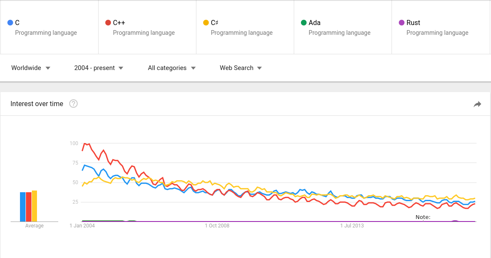

% Introduction to Ada, and Formal Specifications
% Simon Symeonidis

# Introduction

# History

- Where did Ada come from?
- Where is it going?

# It came from the DoD

- Dark Overwhelming Drakes
- Department of Defense
    - Balls to the wall requirements
    - aircrafts need advantages
    - fighter pilots fight enemies, not your software

# What did the DoD require from PLT?

- A language that is safe

# One Language to rule them all

- Originally the motivation behind Ada was to have one standard
  language for a number of application in the DoD.
- They had a lot of different application written in different
  languages that did things poorly.
- Speculated maintenance nightmare.

# One Language find them all

- There was a competition to find a language that fit a lot of use
  cases the DoD had.
- These requirements were known as the `Steelman Language
  Requirements`. [Steelman]
- A language design finally won in this competition, and it was going
  to be known as `Ada`.

# Is Ada popular yet?

- Nope, and probably will never be.


# Why does Ada look that way

- empirical studies on:
    - usability
    - readability
    - and all that good stuff

# What is happening to Ada

- language still actively being developed on
- some example releases:
    - Ada83
    - Ada95
    - Ada2005
    - Ada2012
- this has lead the language to become massive
- like really big
- really really big

# Readability

- Things are readable, right?

```ada
procedure Main is
begin
   null;
end Hello_World;
```

# Where to go when in doubt

- Ada has the BNF trees/specs freely available and are pleasantly
  readable.

# Alright, let's begin with stuff

- You need an Ada compiler. At the time of writing, there's two
  compilers available.
    - gcc-ada (gnu)
    - adacore ada (commercial, and free if open source)

# First things First

- A very common programming construct to understand for Ada is the
  following:

```nocode
<program unit name>
  <declarations>
  <code body>
```

- That is, unlike some programming languages, your variable
  declarations must all be present within the declaration block.

- Just like C/C++, we have headers and implementation
  files. In Ada, these files are Signature (ads), and Body files (adb)
  respectively.

# Before we start

- To compile things you need to run `gnatmake` on a file.
- For our purposes a simple file called `main.adb` will suffice.

```nocode
$ gnatmake main.adb
```

# I have no mouth and I must scream

- Let's write a very simple program.

```ada
-- main.adb
procedure Main is
begin
   null;
end Main;
```

# Including standard libraries

```ada
-- main.adb
with Ada.Text_IO; use Ada.Text_IO;
procedure Main is
begin
   Ada.Text_IO.Put_line("pleh dnes");
end package Main;
```

# Functions, Procedures

- Ada has functions and procedures.
- Procedures return nothing
- Functions return some type
- Functions and procedures must be declared in the declarative part of
  the function or procedure.

# Functions, Procedures: Procedures

```ada
with Ada.Text_IO; use Ada.Text_IO;

procedure Main is
   procedure Do_Thing(X : Integer) is begin
      Put_Line("im doing the thingy thing" & X'Img);
   end Do_Thing;
begin
   Do_Thing(123);
   -- output: im doing the thingy thing 123
end Main;
```

# Functions, Procedures: Function Syntax

```ada
with Ada.Text_IO; use Ada.Text_IO;

procedure Main is
   function Funcky_Thing(X : Integer; Y : Integer) return Integer is
      Result : Integer := X + Y;
   begin
      return Result;
   end Funcky_Thing;

   Val : Integer;
begin
   Val := Funcky_Thing(10, 12);
   Put_Line("funcky: " & Val'Img);
end Main;
```

# Functions, Procedures: Ins and Outs

```ada
with Ada.Text_IO; use Ada.Text_IO;

procedure Main is
   procedure Em_Pleh
     (X: in Integer; Y: out Integer; Z: in out Integer) is
   begin
      case X is
         when 1       => Y := 10;
         when 2 .. 10 => Y := 90;
         when others  => Y := 666;
      end case;
      Z := Z + 1;
   end Em_Pleh;
   type Range_Type is range 1 .. 10;
   M_X, M_Y, M_Z : Integer := 0;
begin
   for I in Range_Type loop
      Em_Pleh (X => M_X, Y => M_Y, Z => M_Z);
   end loop;
   Put_Line ("X:" & M_X'Img & " Y:" & M_Y'Img & " Z:" & M_Z'Img);
end Main;
```

# Small Exercise

# Parallel Programming

- Ada was designed to have parallel programming in the core language.
- You can get this sort of thing by using `Tasks`

# Formal Specifications

- motivation

# References

- [Steelman] https://www.dwheeler.com/steelman/steelman.htm
